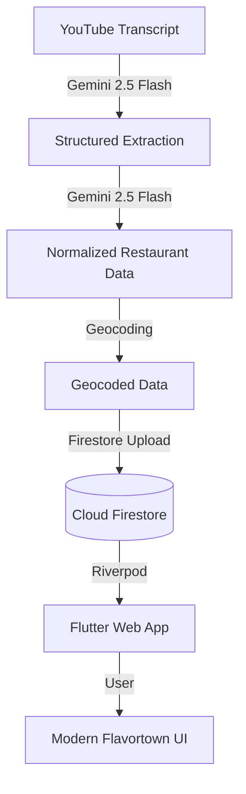

# TripleDB

**Every restaurant from Diners, Drive-Ins and Dives — structured, searchable, and mapped.**

🌐 **[tripledb.net](https://tripledb.net)** · 📂 **29 iterations** · 🔧 **Status: Live**

TripleDB is a high-performance Flutter application designed to visualize and explore the culinary landscape of Guy Fieri's *Diners, Drive-Ins and Dives*. It provides a modern, responsive interface for searching, mapping, and discovering the full dataset of restaurants featured on the show.

## 🚀 Live Dataset Metrics (v6.29)

- **1,102** unique restaurants across **62** states and territories.
- **2,286** dishes with ingredients and Guy's reactions.
- **2,336** video appearances from **773** processed YouTube videos.
- **916** restaurants with map coordinates (geocoded).
- **432** cross-video dedup merges.

## 🛠️ Tech Stack

### Frontend (App)
- **Framework:** [Flutter Web](https://flutter.dev/) (CanvasKit)
- **State Management:** [Riverpod 2.x](https://riverpod.dev/) (Generator-based)
- **Navigation:** [GoRouter 14.x](https://pub.dev/packages/go_router)
- **Maps:** [flutter_map 7.x](https://pub.dev/packages/flutter_map) + [flutter_map_marker_cluster](https://pub.dev/packages/flutter_map_marker_cluster)
- **Data Source:** [Cloud Firestore](https://firebase.google.com/docs/firestore)

### Backend (Pipeline)
- **Extraction:** Gemini 2.5 Flash API (Structured Outputs)
- **Normalization:** Gemini 2.5 Flash API (Deduplication & Schema Alignment)
- **Geocoding:** OpenStreetMap Nominatim / Custom Geocoding Service
- **Hosting:** Firebase Hosting

## 🏗️ Architecture

## 💎 IAO Eight Pillars

TripleDB is built using the **Iteration-Agile Operations (IAO)** methodology, adhering to these eight pillars:

1. **Atomic Iterations:** Every change is a discrete, versioned step.
2. **Empirical Validation:** Decisions are driven by data and reproduction.
3. **Artifact Supremacy:** Documentation (Build/Report) is as important as code.
4. **Tool-First Efficiency:** Leverage AI and automation at every stage.
5. **Contextual Integrity:** Respect existing patterns and architectural debt.
6. **Safety by Default:** Protect credentials and system state.
7. **Proactive Orchestration:** Agents lead the plan, humans approve the goal.
8. **Feedback-Driven Evolution:** Continuous refinement based on real-world usage.

## 📝 Changelog (Abbreviated)

### [v6.29] — 2026-03-27
- **Trivia Fix:** Filtered out 'UNKNOWN' states from trivia counts; now correctly shows 62 states/territories.
- **Map Clustering:** Implemented `flutter_map_marker_cluster` to group overlapping pins, improving performance and readability.
- **Dynamic Trivia:** Updated trivia to compute all facts dynamically from the live Firestore dataset.
- **README Update:** Fully refreshed documentation with current metrics and IAO methodology.

### [v6.28] — 2026-03-27
- **Firestore Restore:** Re-enabled Firestore as the primary data source after v6.27 reversion.
- **Geocoding Fix:** Corrected coordinate mapping for restaurants with missing address components.

### [v6.27] — 2026-03-27
- **Mobile Geolocation:** Fixed permission flow for iOS/Android browsers using "Near Me" gesture-based triggers.

### [v8.25] — 2026-03-23
- **QA & Polish:** Full quality assurance via Playwright and Lighthouse audits. Fixed 404 routes and mobile UI bugs.

### [v8.24] — 2026-03-22
- **Design Overhaul:** Applied "Modern Flavortown" design tokens (Outfit + Inter fonts, Red/Orange palette).

### [v6.26] — 2026-03-21
- **Firestore Load:** Initial migration from local JSONL to live Cloud Firestore.

---
*Last updated: Phase 6.29 — Polish*
